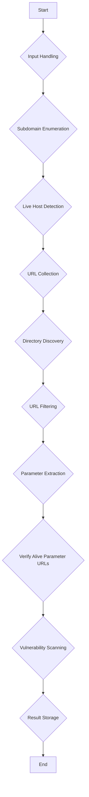

# Web Vulnerability Scanner Design Document

## 1. Introduction

This document outlines the design and architecture for a new automated web vulnerability scanner script, inspired by the user's requirements for a cleaner, faster, modular, and optimized tool for bug bounty reconnaissance and vulnerability discovery. The script will be developed in Python 3 and designed for Kali Linux/Linux environments, integrating common bug bounty tools to automate the full reconnaissance → crawling → filtering → vulnerability scanning pipeline.

## 2. General Goal

The primary goal is to create a high-performance automation scanner that accepts single, multiple, or file-based domain inputs, performs automated subdomain discovery, live host detection, URL discovery, endpoint/parameter extraction, and vulnerability scanning. It will save structured results for later manual analysis and support optional notifications.

## 3. Core Features and Phases

The scanner will implement the following 10 core phases:

### Phase 1: Input Handling
- **Accepts domains via:** CLI arguments, file input.
- **Processing:** Normalize domains, remove duplicates, support resume capability.

### Phase 2: Subdomain Enumeration
- **Tools:** `subfinder`, `assetfinder` (optional).
- **Output:** `subdomains.txt`

### Phase 3: Live Host Detection
- **Tool:** `httpx-toolkit`.
- **Features:** Detect alive hosts, follow redirects, detect status codes.
- **Output:** `alive_subdomains.txt`

### Phase 4: URL Collection
- **Tools:** `waybackurls`, `gau`, `katana`.
- **Output:** `all_urls.txt` (merged results)

### Phase 5: Directory Discovery
- **Tool:** `dirsearch`.
- **Process:** Run against alive hosts, append discovered paths to the URL list.

### Phase 6: URL Filtering
- **Filters:** In-scope domains, unique URLs.
- **Removes:** Static files (css, js, images), third-party domains.
- **Output:** `filtered_urls.txt`

### Phase 7: Parameter Extraction
- **Process:** Extract URLs containing parameters (e.g., `https://target.com/page.php?id=1`).
- **Output:** `params.txt`

### Phase 8: Verify Alive Parameter URLs
- **Tool:** `httpx`.
- **Process:** Re-check parameter URLs for liveness.
- **Output:** `alive_params.txt`

### Phase 9: Vulnerability Scanning
- **Tool:** `Nuclei`.
- **Features:** Severity filtering, concurrency, rate limits, scan only parameter URLs.
- **Output:** `findings.json`, `findings.txt`, `findings.csv`

### Phase 10: Result Storage
- **Structure:** `output/target.com/` containing all phase-specific output files and vulnerability findings.

## 4. Performance Requirements

- Multithreading or concurrency
- Parallel execution of some tools
- Rate limiting
- Timeout protection
- Memory efficient file processing
- Large target support

## 5. User Experience

- CLI arguments with `argparse`
- Colored terminal output
- Progress messages
- Error handling
- Dependency checking
- Clean logging

**Example CLI Usage:**
```bash
python3 scanner.py example.com
python3 scanner.py -l domains.txt
```

**Optional Flags:**
`--skip-subfinder`, `--crawl-only`, `--threads 50`, `--rate-limit 100`, `--resume`

## 6. Optional Advanced Features

- Telegram notifications for findings
- JSON structured logging
- Graceful CTRL+C handling
- Resume scanning capability
- Vulnerability severity summary
- Automatic deduplication
- Configurable tool paths

## 7. Code Requirements

- Written in Python 3
- Fully working and modular
- Well-structured with clear functions

**Example Function Structure:**
- `check_dependencies()`
- `run_subfinder()`
- `run_httpx()`
- `collect_urls()`
- `run_katana()`
- `run_dirsearch()`
- `filter_urls()`
- `extract_params()`
- `verify_alive_params()`
- `run_nuclei_scan()`
- `save_results()`

## 8. High-Level Architecture

The script will follow a modular design, with each phase encapsulated in its own function or a set of related functions. A `main` function will orchestrate the execution flow, handling argument parsing, dependency checks, and calling the phase-specific functions sequentially. Concurrency and parallelism will be implemented using Python's `concurrent.futures` module (ThreadPoolExecutor or ProcessPoolExecutor) where appropriate, especially for external tool execution.

Error handling will be robust, with clear messages and graceful exits. Logging will be implemented using Python's `logging` module, supporting both console output and file logging. Configuration for tool paths, API keys (if any for notifications), and other settings will be managed through a configuration file or environment variables.



## 9. Tool Integration Strategy

External tools like `subfinder`, `httpx`, `waybackurls`, `gau`, `katana`, `dirsearch`, and `nuclei` will be executed as subprocesses using Python's `subprocess` module. Their outputs will be captured, processed, and passed as input to subsequent phases. This approach ensures flexibility and allows for easy updates to individual tools without affecting the core scanner logic. Error handling for subprocess execution will include checking return codes and parsing stderr for diagnostic information.

## 10. Data Flow and Storage

Intermediate results from each phase will be stored in temporary files within the `output/target.com/` directory structure. This ensures data persistence and facilitates the resume capability. Final results will be consolidated and saved in multiple formats (JSON, TXT, CSV) for comprehensive analysis.
